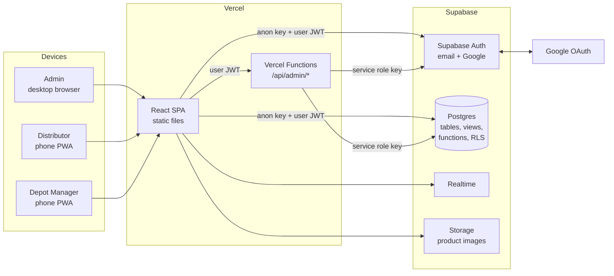
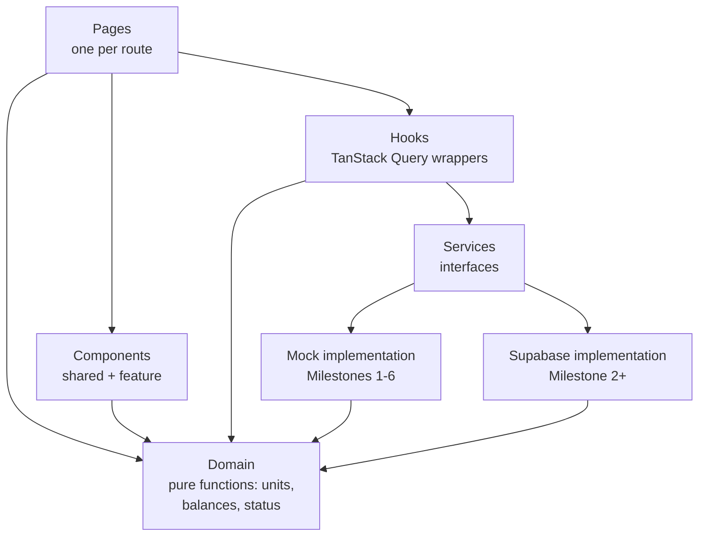
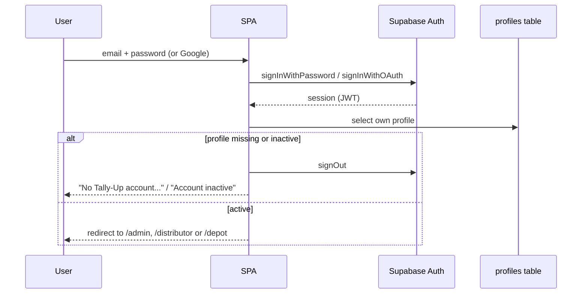

# Tally-Up — System Architecture

**Status:** v0.2 — v0.1 APPROVED by owner 2026-10-02 (including T-1 to T-10); v0.2 amendments below follow owner decisions of the same day
**Date:** 2026-10-02
**Depends on:** `docs/REQUIREMENTS.md` v0.4. Requirement IDs (e.g. `DIS-06`) refer to that document.

### Amendments in v0.2

| # | Change | Reason (owner decision) |
|---|---|---|
| A-1 | Supabase is connected in **Milestone 2**, not Milestone 7. Testers on different phones share one database from Milestone 2 onward. | Q-37: deploy and test early across devices |
| A-2 | The mock backend (Section 7) is kept **only for automated tests and offline local development**. It is not deployed. | Follows A-1 |
| A-3 | The app is deployed to Vercel and installable as a PWA from **Milestone 1**. | Q-37 |
| A-4 | Google sign-in works as soon as the owner adds the Google OAuth client in Supabase. No "Not available yet" period beyond that. | Follows A-1 |

### Proposed in A1 (v0.3 draft — accepted when the owner approves the A1 pull request)

Technical details the A1 build needed that this document did not spell out. None change business behaviour. Details and reasons: `docs/adr/0002-a1-admin-login.md`.

| # | Change | Section |
|---|---|---|
| A-5 | The build reads the Supabase URL and **public** key under the names the Vercel integration creates (`SUPABASE_URL`, `NEXT_PUBLIC_SUPABASE_ANON_KEY`, … as well as `VITE_*`), and **stops** if the key found is a secret key. | §15 |
| A-6 | Supabase Auth uses the **implicit** flow, so a reset link works even when the email opens in a different browser from the installed app. | §5.2 |
| A-7 | The login audit entry (AUD-03) is written by the database function `record_login(method)`, called by the app right after sign-in; it records only the caller's own login. A login that cannot be recorded is refused. Other audit entries still come from triggers (§6.1). | §6.4 |
| A-8 | Sign Out acts at once from the account menu and Profile, showing "Signing out…" (Q-56). It ends this device's session only (scope "local"). Back is a link at the top of the page content, set per route (`handle.backTo`), never in the header (Q-56). A loading bar shows while a screen loads. | §4 |
| A-9 | Portals whose milestone has not arrived refuse sign-in with a plain message (`OPEN_PORTALS` in `src/auth/access.ts`, Q-55). | §4.5 |
| A-10 | Database tests run on a plain Postgres 16 with pgTAP, using a small stand-in for Supabase's `auth` schema (`supabase/tests/stub/`). Migrations follow the Supabase CLI naming (`<timestamp>_<name>.sql`). | §6.7, §16 |

### Accepted in A2c (A2c merged and signed off by the owner, 2026-10-04)

Technical details the Users build needed. None change business behaviour. Details and reasons: `docs/adr/0003-a2-admin-data.md` (#13 to #19).

| # | Change | Section |
|---|---|---|
| A-11 | The admin endpoints are Vercel Functions as Web `Request`/`Response` handlers: `POST /api/admin/users`, `PATCH /api/admin/users/:id`, `POST /api/admin/users/:id/reset-password`. Shared code is in `api/_lib/`. Each call verifies the caller's token with Supabase and requires an active admin profile before acting. | §6.6 |
| A-12 | The database functions `admin_save_user()` and `admin_record_password_reset()` take the acting admin as an argument and may be executed only by the service role. They check "active admin" again and write the audit log. A new login is created first, and removed again if its profile is refused. | §6.4, §6.6 |
| A-13 | `SUPABASE_SERVICE_ROLE_KEY` (and the URL) are read only in `api/`. The CI `secrets` check keeps the key out of `src/`, `public/` and `VITE_*` names. | §15 |

This document describes **how** the system is built. It adds no business rules.
Technical choices not already fixed by the requirements are marked **[PROPOSED]** and listed in Section 17 for approval.

---

## 1. System Overview



Three parts:

| Part | What it is | Runs on |
|---|---|---|
| Frontend | One React single-page app holding all three portals. Installable as a PWA. | Vercel (static hosting) |
| Backend | Supabase: Postgres database, auth, row-level security, realtime, storage. Business rules that must not be bypassed live in the database. | Supabase, connected through the Vercel Marketplace |
| Admin API | A few small server functions for actions that need the secret service-role key (creating users, resetting passwords). | Vercel Functions |

There is no separate custom backend server. The database enforces the rules; the frontend displays them.

From Milestone 2 the deployed app talks to Supabase. A **mock backend** with the same interfaces (Section 7) is used only for automated tests and offline local development. The frontend does not know which one it is talking to.

---

## 2. Technology Stack

| Layer | Choice | Source |
|---|---|---|
| Language | TypeScript (strict mode) | Spec |
| Build | Vite | Spec |
| UI | React, Tailwind CSS, shadcn/ui, Lucide icons | Spec |
| Routing | React Router | Spec |
| Server state | TanStack Query | Spec |
| Forms + validation | react-hook-form + Zod | [PROPOSED] |
| Dates / time zone | date-fns + @date-fns/tz (Africa/Douala) | [PROPOSED] |
| PDF export | @react-pdf/renderer, generated in the browser | [PROPOSED] |
| PWA | vite-plugin-pwa | [PROPOSED] |
| Backend | Supabase (Postgres, Auth, RLS, Realtime, Storage) via Vercel Marketplace | Owner decision Q-34 |
| Supabase client | @supabase/supabase-js | — |
| Hosting | Vercel | Owner decision |
| Unit tests | Vitest + React Testing Library | [PROPOSED] |
| End-to-end tests | Playwright | [PROPOSED] |
| Lint / format | ESLint + Prettier | [PROPOSED] |

---

## 3. Frontend Architecture

### 3.1 Layers



Rules:
- **Pages** compose components and call hooks. No data fetching code in pages.
- **Components** receive data through props. No direct service calls.
- **Hooks** are the only place TanStack Query is used.
- **Services** are interfaces. Two implementations exist: mock and Supabase. One environment variable picks which.
- **Domain** holds pure functions with no React or network code: loaf conversion, remaining balance, receipt status, collection status. Both the UI and the mock backend use them. The Supabase SQL mirrors them, and tests check that both give the same answers.

### 3.2 Folder Structure

```
src/
  main.tsx
  app/
    App.tsx                 # providers + router
    router.tsx              # all routes in one place
    providers.tsx           # QueryClient, Auth, Theme, Toaster
  config/
    business-rules.ts       # Section 11 of requirements
    env.ts                  # typed, validated env variables
  domain/
    units.ts                # toLoaves, fromLoaves, breakdown
    balances.ts             # collected / distributed / remaining
    status.ts               # collection + receipt status
    validation.ts           # Zod schemas shared by forms and services
  types/
    entities.ts             # User, Depot, Product, Collection, ...
    enums.ts                # Role, Unit, statuses
  auth/
    AuthProvider.tsx
    useAuth.ts
    RequireRole.tsx         # route guard
    permissions.ts          # what each role may do
  services/
    interfaces/             # CollectionService, DistributionService, ...
    mock/                   # in-browser implementation + seed data
    supabase/               # live implementation (Milestone 2+)
    index.ts                # picks implementation from env
  hooks/
    useCollections.ts
    useDistributions.ts
    useReceipts.ts
    ...
  layouts/
    AdminLayout.tsx         # sidebar + header
    DistributorLayout.tsx   # bottom nav
    DepotLayout.tsx         # bottom nav
    AuthLayout.tsx          # login pages
  pages/
    auth/
    admin/
    distributor/
    depot/
  components/
    ui/                     # shadcn/ui generated components
    common/                 # StatusBadge, QuantityInput, EmptyState, ...
    admin/
    distributor/
    depot/
  lib/
    format.ts               # numbers, dates in Africa/Douala
    export/                 # PDF builders
  i18n/
    en.ts                   # all UI strings (NFR-12)
api/                        # Vercel Functions (Milestone 2+)
  admin/
supabase/
  migrations/               # SQL, numbered, never edited after merge
  seed.sql
tests/
  e2e/                      # Playwright
docs/
```

### 3.3 State Management

| Kind of state | Where it lives |
|---|---|
| Data from the backend | TanStack Query cache. Never copied into other stores. |
| Logged-in user + role | `AuthProvider` React context |
| Form input in progress | react-hook-form, local to the form |
| Multi-step flows (New Collection, Distribute, Confirm Receipt) | Local state in the flow's parent page. Lost on refresh; nothing is saved until Submit. |
| Filters on report pages | URL query string, so a filtered report can be bookmarked and the PDF export reads the same filters (RPT-03) |

No global store library (Redux, Zustand) is needed.

### 3.4 Shared UI Components

Built once, used everywhere:

| Component | Purpose |
|---|---|
| `StatusBadge` | One colour and label per status (NFR-11) |
| `QuantityInput` | Large numeric field, numeric keypad, whole numbers only |
| `UnitQuantityRow` | Product + unit picker + quantity, with live loaf total |
| `LoafBreakdown` | "430 Loaves (8 Caisse + 3 Packs)" (DIS-02) |
| `EmptyState`, `ErrorState`, `PageSkeleton` | NFR-07 |
| `ReviewSheet` | Final review before any submit |
| `SubmitButton` | Disables while pending; blocks double submit (COL-09) |
| `ConnectionBanner` | "No connection" and blocked submits (NFR-06) |
| `DataTable` / `CardList` | Table on desktop, cards on mobile |

---

## 4. Routes

All routes are defined in `src/app/router.tsx`. Every portal is wrapped by a `RequireRole` guard.

### 4.1 Public

| Path | Page |
|---|---|
| `/login` | Email + password, Google button |
| `/forgot-password` | Reset request |
| `/reset-password` | Set new password from email link (Milestone 2+) |
| `/auth/callback` | Google sign-in return (once the owner adds the Google OAuth client) |
| `/` | Redirects to own portal, or `/login` |
| `*` | Not found |

### 4.2 Admin — `/admin/*` (role: admin)

| Path | Page |
|---|---|
| `/admin` | Dashboard: KPIs + today's activity |
| `/admin/collections` | All collections, filterable |
| `/admin/collections/:id` | Collection detail + depot allocations |
| `/admin/distributions` | All distributions / receipts |
| `/admin/distributions/:receiptId` and `/admin/collections/:collectionId/receipts/:receiptId` | Receipt detail: recorded vs counted, corrections. One page, two routes, so Back stays inside the tab (Q-56, ADR 0004 #11) |
| ~~`/admin/discrepancies`~~ | Not built: discrepancies are shown on Home and inside Distributions (Q-58b) |
| `/admin/depots` | Depot list |
| `/admin/depots/new` | Create depot |
| `/admin/depots/:id` | Depot detail + history |
| `/admin/depots/:id/edit` | Edit depot |
| `/admin/products` | Product list |
| `/admin/products/new` | Create product + units + loaves per unit |
| `/admin/products/:id` | Edit product (A2a: the product opens straight into its form; there is no separate detail page) |
| `/admin/users` | User list |
| `/admin/users/new` | Create user |
| `/admin/users/:id/edit` | Edit user, reset password, assign depot |
| `/admin/reports` | Filters + results + PDF export |
| `/admin/audit` | Audit log |
| `/admin/notifications` | Notifications |
| `/admin/settings` | Business rules display (Section 11 of requirements) |
| `/admin/more` | More tab: Depots, Products, Users, Reports (Q-47) |
| `/admin/profile` | Profile / My Account (account menu, Q-47) |

### 4.3 Distributor — `/distributor/*` (role: distributor)

| Path | Page |
|---|---|
| `/distributor` | Dashboard: today's summary, active collections, New Collection |
| `/distributor/collections` | Own collections |
| `/distributor/collections/new` | New Collection flow (add → review → submit → success) |
| `/distributor/collections/:id` | Collection balance + its distributions |
| `/distributor/collections/:id/distribute` | Distribute flow (depot → quantities → review → submit → success) |
| `/distributor/distributions` | Own distributions with receipt status |
| `/distributor/distributions/:id` | One distribution + depot result |
| `/distributor/notifications` | Notifications |
| `/distributor/profile` | Profile, sign out |

### 4.4 Depot Manager — `/depot/*` (role: depot_manager)

| Path | Page |
|---|---|
| `/depot` | Dashboard: pending receipts first, today's confirmed |
| `/depot/receipts` | Pending receipts |
| `/depot/receipts/:id` | Receipt: recorded, count entry, comment, review, confirm |
| `/depot/history` | Depot receipt history |
| `/depot/notifications` | Notifications |
| `/depot/profile` | Profile, sign out |

### 4.5 Guard Behaviour

1. No session → redirect to `/login`, remembering the requested path.
2. Session but wrong role → redirect to the user's own portal home. No error page that reveals what exists.
3. Session for a deactivated user → sign out, show "Your account is inactive."
4. Record-level access (e.g. a manager opening another depot's receipt ID) is refused by the **backend**, and the page shows "Not found". The guard alone is never trusted (AUTH-10).

---

## 5. Authentication

### 5.1 Flow



### 5.2 Rules

- **Role is read from the `profiles` table**, never from data the user can edit (Supabase `user_metadata` is user-editable and is not used for roles).
- **Public signup is disabled** in Supabase Auth settings. Only Admin-created users exist.
- **Google sign-in** works for an email that already has an account. Supabase links the Google identity to the existing user by matching verified email. An unknown Google email is refused because signup is disabled (AUTH-04). *This linking behaviour is verified in Milestone 2 before Google is switched on.*
- **Creating users** needs the Supabase service-role key, which must never reach the browser. The Admin UI calls `POST /api/admin/users` (Vercel Function). The function checks the caller's JWT, confirms they are an active admin, then creates the auth user and profile.
- **Password reset by Admin**: `POST /api/admin/users/:id/reset-password`, same checks.
- **Forgot password**: Supabase sends the email; the link opens `/reset-password`.
- **Sessions**: Supabase stores the session and refreshes tokens. On deactivation, the next request fails RLS and the app signs the user out.

### 5.3 Mock Auth (tests and offline local development only)

- Seeded users, one per role plus extras, with known demo passwords listed in the README.
- Session stored in `localStorage`.
- Google button disabled in the mock.
- Same `AuthService` interface as Supabase. Never deployed.

---

## 6. Backend (Supabase)

### 6.1 Principle

Rules that protect the numbers live in Postgres, not in the browser:

| Rule | Enforced by |
|---|---|
| Who can see which rows | Row Level Security policies |
| No over-distribution | `submit_distribution()` function, with a row lock on the collection |
| Confirm once, then locked | `confirm_receipt()` function + no UPDATE policy for managers |
| No hard delete | No DELETE policy on any operational table |
| Corrections never overwrite | `admin_correct()` writes to `corrections`; source rows untouched |
| Audit trail | Database triggers write `audit_log` |
| Notifications | Database triggers write `notifications` |
| Collection / receipt numbers | Postgres sequences |
| Timestamps | `default now()` on the server; client clock never used |

The frontend repeats the same checks only to give instant feedback.

### 6.2 Schema

Matches requirements Section 9. All ids are `uuid`. All timestamps are `timestamptz` (UTC).

```sql
-- master data
profiles            (id uuid pk = auth.users.id, full_name, email, phone, role, depot_id, status, created_at)
depots              (id, name, location, address, phone, status, created_at)
products            (id, name, code unique, description, status, created_at)   -- no image (Q-57e)
product_units       (id, product_id, unit, loaves_per_unit int > 0, unique(product_id, unit))

-- operations (insert-only for normal users)
collections         (id, number, distributor_id, created_at)
collection_items    (id, collection_id, product_id, unit, quantity int > 0, loaves_per_unit_snapshot int)
distributions       (id, number, collection_id, depot_id, distributor_id, created_at)
distribution_items  (id, distribution_id, product_id, unit, quantity int > 0, loaves_per_unit_snapshot int)
confirmations       (id, distribution_id unique, manager_id, comment, confirmed_at)
confirmation_counts (id, confirmation_id, distribution_item_id, unit, quantity int >= 0, loaves_per_unit_snapshot int)

-- trail
corrections         (id, target_table, target_id, field, original_value, corrected_value, admin_id, note, created_at)
notifications       (id, user_id, type, record_type, record_id, message, read_at, created_at)
audit_log           (id, user_id, action, record_type, record_id, details jsonb, created_at)
```

Constraint notes:
- A depot manager's `depot_id` is required (check constraint on role).
- One active manager per depot: partial unique index on `profiles(depot_id) where role = 'depot_manager' and status = 'active'`.
- `confirmations.distribution_id` is unique → a receipt can only be confirmed once.

### 6.3 Views (computed, never stored)

| View | Gives |
|---|---|
| `v_collection_product_balance` | Per collection, per product: collected, distributed, remaining (loaves) — with corrections applied |
| `v_collection_status` | In Progress / Fully Distributed |
| `v_receipt_line` | Per distribution item: recorded loaves, counted loaves, difference |
| `v_receipt_status` | Awaiting / Confirmed / Confirmed with Discrepancy |
| `v_daily_kpis` | Admin dashboard numbers per unit, per Douala day |

Views use `security_invoker`, so RLS still applies to whoever reads them.

### 6.4 Database Functions (the only write paths for operations)

| Function | Called by | Does |
|---|---|---|
| `submit_collection(items)` | Distributor | Validates units belong to product, snapshots loaves_per_unit, inserts collection + items |
| `submit_distribution(collection_id, depot_id, items)` | Distributor | Locks the collection row, recomputes remaining, rejects if any product would go below zero, inserts distribution + items |
| `confirm_receipt(distribution_id, counts, comment)` | Depot Manager | Checks the receipt belongs to the manager's depot and is unconfirmed, inserts confirmation + counts |
| `admin_correct(target, field, new_value, note)` | Admin | Checks COR-03, inserts correction row |
| `mark_notifications_read(ids)` | Any | Sets `read_at` on own notifications |

The row lock in `submit_distribution` stops two phones distributing the same bread at the same moment.

### 6.5 Row Level Security Summary

| Table | Admin | Distributor | Depot Manager |
|---|---|---|---|
| profiles | all | own row | own row |
| depots | all | read active | read own depot |
| products, product_units | all | read active | read |
| collections, collection_items | read | read own | — |
| distributions, distribution_items | read | read own | read where depot = own depot |
| confirmations, confirmation_counts | read | read for own distributions | read own depot |
| corrections | read, insert via function | read for own records | read for own depot |
| notifications | own | own | own |
| audit_log | read | — | — |

"Insert" on operational tables happens only through the functions in 6.4. No role has UPDATE or DELETE on operational tables.

### 6.6 Admin API (Vercel Functions)

| Endpoint | Purpose |
|---|---|
| `POST /api/admin/users` | Create auth user + profile |
| `PATCH /api/admin/users/:id` | Edit, activate/deactivate, assign depot |
| `POST /api/admin/users/:id/reset-password` | Set new password |

Every function: verify JWT → load caller profile → require active admin → act → write audit log. The service-role key exists only in Vercel's server environment.

### 6.7 Migrations

- SQL files in `supabase/migrations/`, numbered, applied in order.
- A merged migration is never edited; changes go in a new file.
- RLS policies and functions live in migrations, so the database is reproducible from the repository.

---

## 7. Mock Backend (tests and offline local development only)

- Implements the same service interfaces as Supabase.
- Stores data in `localStorage` so it survives a refresh. A "Reset demo data" action restores the seed.
- Uses the same `domain/` functions for balances and status.
- Enforces the same rules as 6.1: role filtering, over-distribution check, single confirmation, no delete, corrections table, audit and notification writes.
- Adds a small random delay (200–600 ms) so loading states are exercised.
- Can be set to fail a request on purpose, to test error states.
- Seed data: Douala depots from the spec (Akwa, Bonaberi, Makepe), the spec's products (Big Bread, Small Bread, Milk Bread) with sample loaves-per-unit, one admin, two distributors, three depot managers, and a few days of history including discrepancies.

The mock is a development tool. It is not deployed. The Supabase staging project is loaded with the same seed data (`supabase/seed.sql`) so testers start with realistic records.

---

## 8. Domain Logic

Pure TypeScript in `src/domain/`, fully unit-tested. Mirrored in SQL views/functions.

| Function | Rule |
|---|---|
| `toLoaves(quantity, loavesPerUnit)` | `quantity × loavesPerUnit` |
| `breakdown(loaves, productUnits)` | 430 → "8 Caisse + 3 Packs" (largest unit first) |
| `remaining(collectionItems, distributionItems)` | per product, in loaves (REC-01) |
| `maxGiveable(remainingLoaves, loavesPerUnit)` | `floor(remaining / loavesPerUnit)` for DIS-06 message |
| `collectionStatus(balances)` | COL-08 |
| `receiptLineDifference(recorded, counts)` | REC-02 |
| `receiptStatus(lines, confirmed)` | RCP-11 |

A shared test fixture runs the spec's Section 3 and Section 57 examples against both the TypeScript and (from Milestone 2) SQL versions.

---

## 9. Notifications

- Rows in `notifications`, written by database triggers (mock: by the mock service).
- Frontend shows an unread count in the header/bottom nav.
- **Delivery to the screen**: [PROPOSED] Supabase Realtime subscription on the user's own notifications ; polling every 30 s in the mock.
- All creation goes through one place (trigger / `NotificationService`), so web push can be added later without touching callers (NOT-05).

---

## 10. Reports and PDF Export

- Report pages read filters from the URL.
- The same filter object drives the on-screen query and the export, so the PDF always matches the screen (RPT-03).
- PDF is built in the browser from the already-filtered data. RLS still applies, so a user can never export rows they can't see.
- Each PDF includes: title, filters used, generation time (Douala), generated-by user, and page numbers.
- An `Exporter` interface (`exportPdf`, later `exportCsv`) keeps CSV a drop-in addition.

---

## 11. PWA

- Web app manifest: name, icons, theme colour, `display: standalone`, start URL by role.
- Service worker caches the **app shell only** (HTML, JS, CSS, icons, fonts).
- API calls are **network-only**. No data is cached for offline use, and nothing is queued (NFR-06).
- Offline: `ConnectionBanner` shows "No connection" and submit buttons are disabled.
- Update prompt: "A new version is available — Reload".

---

## 12. Time and Numbers

- Database stores UTC. Display converts to `Africa/Douala`.
- "Today" = from 00:00 to 23:59 Douala time, computed on the server for KPIs.
- Numbers formatted with thousands separators (e.g. 1,500).
- All quantities are integers end to end. No floating-point math on quantities.

---

## 13. Error Handling and Feedback

| Situation | User sees |
|---|---|
| Loading | Skeleton |
| Empty | `EmptyState` with the spec's wording (e.g. "No receipts awaiting confirmation.") |
| Validation error | Message under the field, in plain words |
| Business rule refused by backend (e.g. over-distribution) | The backend's message, shown on the form; form keeps the input |
| Network / server error | `ErrorState` with "Try again"; form input kept |
| Success | Success screen for main flows; toast for admin edits |
| Session expired | Redirect to `/login`, return to page after sign-in |

Backend functions return error codes (e.g. `OVER_DISTRIBUTION`, `ALREADY_CONFIRMED`). The frontend maps codes to messages in `i18n/en.ts`.

---

## 14. Security

- Role checks in three places: route guard (convenience), service layer (mock), RLS + database functions (real enforcement).
- Service-role key only in Vercel Functions' server environment.
- Browser gets only the Supabase URL and anon key, which are safe to expose because RLS protects data.
- No secrets in the repository. `.env.example` lists variable names only.
- Security headers set in `vercel.json` (Content-Security-Policy, X-Frame-Options, Referrer-Policy).
- Product image upload (Milestone 3) limited to images, size-capped, admin-only bucket policy.

---

## 15. Environments and Deployment

| Environment | Frontend | Backend | Trigger |
|---|---|---|---|
| Local | `npm run dev` | Mock (offline) or Supabase staging | Developer |
| Preview | Vercel preview URL (installable PWA) | Supabase staging project | Every push to a branch, from Milestone 1 |
| Production | Vercel production domain | Supabase production project | Merge to main |

Environment variables:

| Name | Where | Purpose |
|---|---|---|
| `VITE_DATA_SOURCE` | browser | `mock` or `supabase` |
| `VITE_SUPABASE_URL` | browser | Supabase project URL |
| `VITE_SUPABASE_ANON_KEY` | browser | Public key |
| `SUPABASE_SERVICE_ROLE_KEY` | Vercel Functions only | Admin user management |
| Google OAuth client ID / secret | Supabase dashboard (not the app) | Set by the owner manually |

The Vercel Marketplace Supabase integration fills the Supabase variables automatically.

---

## 16. Quality: Testing and CI

| Level | Tool | Covers |
|---|---|---|
| Unit | Vitest | `domain/` functions: conversions, balances, status, every example from the spec |
| Component | React Testing Library | QuantityInput, review screens, guards |
| Service | Vitest | Mock backend rules: role filtering, over-distribution, lock, corrections |
| Database | SQL tests (from Milestone 2) | RLS: each role tries to read/write what it must not |
| End-to-end | Playwright | Login per role; spec Section 57 workflow from collection to discrepancy on admin screen |

[PROPOSED] GitHub Actions on every push: typecheck, lint, unit tests, build. A milestone is not handed over unless these pass.

---

## 17. Technical Decisions Needing Approval

None of these change business behaviour. They are the tools and mechanisms.

| # | Decision | Proposal | Alternative |
|---|---|---|---|
| T-1 | Forms and validation library | react-hook-form + Zod | Plain React state |
| T-2 | Date / time-zone library | date-fns + @date-fns/tz | Day.js |
| T-3 | PDF generation | @react-pdf/renderer, in the browser | Server-side PDF in a Vercel Function |
| T-4 | Where admin user-management runs | Vercel Functions (`/api/admin/*`) | Supabase Edge Functions |
| T-5 | Where operational writes run | Postgres functions (RPC) | Vercel Functions |
| T-6 | Live notifications | Supabase Realtime (mock: 30 s polling) | Polling only |
| T-7 | Mock data persistence | localStorage with reset button | In-memory (lost on refresh) |
| T-8 | Testing | Vitest + RTL + Playwright | Vitest only |
| T-9 | CI | GitHub Actions: typecheck, lint, test, build | None |
| T-10 | Environments | Separate Supabase projects for staging and production | One production project only |
