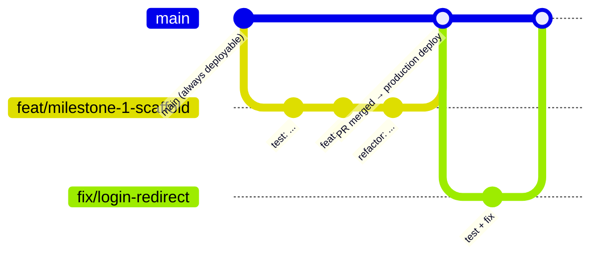

# Tally-Up — Engineering Practices

**Status:** v0.1 — APPROVED by owner 2026-10-02 (ENG-1 per-unit standard; ENG-2 to ENG-10 accepted; ENG-11 deferred)
**Date:** 2026-10-02
**Depends on:** `docs/REQUIREMENTS.md`, `docs/ARCHITECTURE.md`, `docs/UI_GUIDELINES.md`

This document says how code is written, tested, reviewed, versioned and shipped. It applies to every contributor, human or AI.
Items marked **[OWNER]** come from the owner. Items marked **[PROPOSED]** are suggestions listed for decision in Section 16.

---

## 1. Working Rules (scope control)

These come first because the project has been lost twice to unrequested changes.

| # | Rule |
|---|---|
| W-1 | Nothing is built that is not in `REQUIREMENTS.md`, `ARCHITECTURE.md`, or `UI_GUIDELINES.md`. |
| W-2 | A gap or conflict found while coding stops work on that point. The question goes to the owner. No guessing. |
| W-3 | No new dependency (npm package) without owner approval. Each request states: what it does, why existing tools can't, size, licence, maintenance status. |
| W-4 | No change to an approved document without the owner's decision, recorded in that document's decision log. |
| W-5 | No destructive repository actions: no force push, no history rewrite, no branch or repository deletion, no `git reset --hard` on shared branches. |
| W-6 | One task per pull request. Unrelated fixes get their own branch. |
| W-7 | `CLAUDE.md` at the repository root summarises these rules so every AI session reads them first. |

---

## 2. Code Comments [OWNER]

### 2.1 The owner's rule

> Every line of code should have a comment explaining the **why**, **how**, **when**, and the **security implications** if applicable.

### 2.2 How the rule is applied (owner decision ENG-1)

A comment on literally every line (e.g. on `}` or `import React from "react"`) repeats the code and goes stale as code changes, which conflicts with the clean-code rule in Section 4. The proposal keeps the intent — nothing is left unexplained — at the level of each meaningful unit:

| Level | Required comment | Contents |
|---|---|---|
| **File** | Header block at the top of every file | What this file is for, which requirement IDs it implements, where it is used. |
| **Function / component / hook / SQL function / RLS policy** | Doc comment (TSDoc / SQL `COMMENT ON`) on every one, exported or not | **Why** it exists · **How** it works (steps) · **When** it is called · **Security** (who may call it, what it trusts, what it checks) · Requirement IDs. |
| **Logic line or block** | Inline comment on every line or short block that makes a decision, calculates, validates, transforms data, touches auth, or talks to the database | The why. Not a restatement of what the code says. |
| **Security-relevant line** | Always a comment, no exceptions | Starts with `// SECURITY:` and states the threat and the protection. |
| **Business rule line** | Always a comment, no exceptions | Starts with `// RULE <ID>:` e.g. `// RULE DIS-06: block over-distribution, compared in loaves`. |
| **Workarounds** | Always | `// WORKAROUND:` + reason + link to the issue. |
| Trivial syntax (closing braces, plain imports, JSX layout wrappers) | Not required | — |

Example of the proposed standard:

```ts
/**
 * Converts a quantity in any unit into loaves.
 *
 * WHY:  All balances and comparisons are done in loaves (REQ PRD-04, REC-01),
 *       because distributors and managers may use different units.
 * HOW:  Multiplies by the product's loaves-per-unit value captured when the
 *       record was submitted (snapshot), so later admin edits don't rewrite history.
 * WHEN: Called by balance, remaining and difference calculations, and by
 *       the live totals shown while typing quantities.
 * SECURITY: Pure function, no I/O. Rejects non-integers and negatives so bad
 *       input cannot produce fractional or negative stock.
 */
export function toLoaves(quantity: number, loavesPerUnit: number): number {
  // RULE Q-20: quantities are whole numbers only; fail loudly rather than round silently.
  if (!Number.isInteger(quantity) || !Number.isInteger(loavesPerUnit)) {
    throw new RangeError("Quantities must be whole numbers");
  }
  // SECURITY: negative values could be used to inflate "remaining" stock.
  if (quantity < 0 || loavesPerUnit <= 0) {
    throw new RangeError("Quantity must be ≥ 0 and loaves per unit > 0");
  }
  return quantity * loavesPerUnit;
}
```

### 2.3 Comment quality rules

- Comments are updated in the same commit as the code they describe. A stale comment is a bug.
- Comments explain decisions, not syntax.
- Plain English. No jokes, no abbreviations a newcomer wouldn't know.
- No commented-out code. Git keeps history.
- `TODO` only with an issue number: `// TODO(#42): ...`.

---

## 3. Version Control — GitHub Flow [OWNER]

### 3.1 The flow



1. `main` is always working and deployable. Nobody commits to it directly.
2. Every change starts as a short-lived branch from `main`.
3. Commit early and often on the branch; push it. Vercel builds a preview link for every push.
4. Open a pull request (PR) into `main`. CI runs. The owner reviews on the preview link.
5. Owner approves → merge → Vercel deploys `main` to production.
6. Delete the merged branch (normal cleanup, not a destructive action on shared work).

### 3.2 Branch names

| Prefix | Use | Example |
|---|---|---|
| `feat/` | New requirement | `feat/dis-distribute-flow` |
| `fix/` | Bug fix | `fix/remaining-rounding` |
| `refactor/` | Code improvement, no behaviour change | `refactor/balance-service` |
| `test/` | Tests only | `test/rls-depot-manager` |
| `docs/` | Documentation only | `docs/engineering-practices` |
| `chore/` | Tooling, config, dependencies | `chore/eslint-config` |
| `claude/` | Branches created by AI sessions (named by the session) | `claude/practical-ritchie-mnkli1` |

### 3.3 Commit messages — Conventional Commits [PROPOSED]

```
<type>(<scope>): <short summary in present tense>

<body: why this change, not what>

Refs: DIS-06, Q-27
```

Types: `feat`, `fix`, `test`, `refactor`, `docs`, `chore`, `perf`, `security`.
Example: `feat(distribution): block over-distribution in loaves`.

### 3.4 Pull requests

- Template in `.github/pull_request_template.md` with: what, why, requirement IDs, screenshots (mobile + desktop), test evidence, security notes, checklist (Section 9).
- One task per PR. Target: under 400 changed lines, excluding tests and generated files.
- Merge method: **squash merge** [PROPOSED], so `main` has one clean commit per PR.

### 3.5 Repository protection (owner sets in GitHub settings)

Given the project's history, these settings protect the work:

| Setting | Value |
|---|---|
| Default branch | `main` |
| Branch protection on `main` | Require PR, require CI passing, require 1 approval (owner), block force push, block deletion |
| Repository | Do not grant AI tools admin rights; they cannot delete the repository |
| Backup | Not now (owner decision ENG-11). Revisit before go-live. |

---

## 4. Clean Code [OWNER]

| Principle | Rule in this codebase |
|---|---|
| **Meaningful names** | Names say what a thing is in business terms: `remainingLoaves`, not `rem` or `data2`. Booleans read as questions: `isConfirmed`, `hasDiscrepancy`. |
| **Small functions** | A function does one thing. Target ≤ 30 lines; components ≤ 150 lines. Longer means split. |
| **Single Responsibility (S of SOLID)** | One reason to change per module: UI, data access, and business rules live in separate layers (Architecture §3.1). |
| **Open/Closed** | New export formats or data sources are added by implementing an interface, not editing callers (Exporter, services). |
| **Liskov Substitution** | Mock and Supabase services are interchangeable behind the same interface; tests run against both. |
| **Interface Segregation** | Small service interfaces per area (`CollectionService`, `ReceiptService`), not one giant API. |
| **Dependency Inversion** | Pages depend on service interfaces, never on Supabase directly. |
| **DRY** | A business rule exists once in TypeScript (`src/domain/`) and once in SQL, and tests prove both agree. No copy-pasted logic. |
| **KISS** | The simplest code that meets the requirement. |
| **YAGNI** | No code "for later". Future needs are met when they are requirements. |
| **No magic numbers** | Every constant is named; business values live in `config/business-rules.ts`. |
| **Fail fast** | Invalid input throws at the edge with a clear message; no silent defaults. |
| **Pure core** | Business logic is pure functions; side effects at the edges (services, hooks). |
| **Boy-Scout rule** | Leave touched code a little cleaner — inside the scope of the current task only (W-6). |

### 4.1 Refactoring [OWNER]

- Refactor only with passing tests before and after (TDD's third step).
- A refactor commit changes no behaviour. It is never mixed with a feature commit.
- Larger refactors (crossing several modules) get their own `refactor/` branch and PR.
- Triggers: duplicated logic, functions over size limits, unclear names, a test that is hard to write.

---

## 5. Test-Driven Development [OWNER]

### 5.1 The cycle

1. **Red** — write a failing test that states one requirement (named by its ID).
2. **Green** — write the least code that makes it pass.
3. **Refactor** — clean the code; tests stay green.
4. Commit. Repeat.

Commits show the cycle: a `test:` commit (red) may be followed by `feat:` (green) and `refactor:`.

### 5.2 Test naming and traceability

```ts
describe("DIS-06 over-distribution", () => {
  it("rejects giving 5 Packs when only 43 Loaves remain (10 per Pack)", ...);
  it("allows giving exactly the remaining 43 Loaves", ...);
});
```

Every requirement ID has at least one test. `docs/TRACEABILITY.md` [PROPOSED] maps each requirement ID → tests → code files, and is updated in the same PR.

### 5.3 Test pyramid

| Level | Tool | What | Written when |
|---|---|---|---|
| Unit | Vitest | `domain/` rules: conversions, balances, statuses, validation; spec examples §3 and §57 | Before the code (TDD) |
| Component | React Testing Library | Inputs, review screens, guards, empty/error states | Before or with the component |
| Service | Vitest | Mock service rules; same suite run against Supabase staging | Before the service |
| Database | SQL tests (pgTAP) [PROPOSED] | RLS per role, database functions, triggers | Before the migration |
| End-to-end | Playwright + axe-core | Full workflows per role, accessibility | Per milestone, before handover |

### 5.4 Coverage targets [PROPOSED]

| Area | Minimum line coverage |
|---|---|
| `src/domain/` | 100 % |
| `src/services/`, `src/auth/` | 90 % |
| Everything else | 80 % |

Coverage is a floor, not a goal. A test that asserts nothing doesn't count.

### 5.5 Test rules

- Tests are never skipped, disabled, or deleted to make CI pass.
- A bug fix starts with a test that reproduces the bug.
- Tests use the spec's own examples wherever possible.
- No real user data in tests or seed files.

---

## 6. Code Style and Tooling

| Item | Rule |
|---|---|
| TypeScript | `strict: true`, `noUncheckedIndexedAccess: true`. No `any` (use `unknown` and narrow). |
| Lint | ESLint with TypeScript, React, React Hooks, jsx-a11y rules. Zero warnings allowed in CI. |
| Format | Prettier, run on save and in CI. No style debates. |
| Imports | Absolute imports via `@/` alias. Order enforced by lint. |
| Naming | Files: `PascalCase.tsx` for components, `camelCase.ts` otherwise. Types/interfaces `PascalCase`. Constants `UPPER_SNAKE_CASE`. SQL: `snake_case`. |
| Errors | Typed error codes (`OVER_DISTRIBUTION`, `ALREADY_CONFIRMED`), mapped to messages in `i18n/en.ts`. |
| Logging | No `console.log` in committed code. Errors go through one `logger` module (prints in development; production sink decided later). Never log passwords, tokens, or personal data. |
| Pre-commit | Husky + lint-staged [PROPOSED]: format, lint, type-check changed files before each commit. |

---

## 7. Security Practices

Based on the OWASP Top 10 and the architecture's security section.

| # | Rule |
|---|---|
| SEC-1 | Never trust the client. Every rule that protects data is enforced by RLS or a database function. |
| SEC-2 | Least privilege: each role gets only what its screens need (Architecture §6.5). |
| SEC-3 | Secrets only in environment variables (Vercel / Supabase dashboards). `.env*` files are git-ignored; `.env.example` holds names only. |
| SEC-4 | Service-role key only inside Vercel Functions. A CI check fails the build if it appears in client code. |
| SEC-5 | All input validated with Zod at the form and again at the service/database boundary. |
| SEC-6 | No raw SQL string building. Parameterised queries / RPC only. |
| SEC-7 | No `dangerouslySetInnerHTML`. React escapes output by default; keep it that way. |
| SEC-8 | Dependencies: Dependabot alerts on; `npm audit` in CI fails on high/critical. Lockfile committed. |
| SEC-9 | Secret scanning on the GitHub repository (owner enables it). |
| SEC-10 | Security headers in `vercel.json` (CSP, X-Frame-Options, Referrer-Policy, Permissions-Policy). |
| SEC-11 | Each PR states its security impact in the PR template, even if "none". |
| SEC-12 | Every RLS policy has tests proving each role cannot see or change what it must not. |

---

## 8. Database Changes

| # | Rule |
|---|---|
| DB-1 | Every schema change is a numbered migration file in `supabase/migrations/`. No changes made by clicking in the dashboard. |
| DB-2 | A merged migration is never edited. Changes go in a new migration. |
| DB-3 | Migrations run on staging first. Production only after the PR is merged and staging is verified. |
| DB-4 | Destructive migrations (dropping a column or table) need explicit owner approval in the PR. Operational data is never dropped (AUD-01). |
| DB-5 | Seed data lives in `supabase/seed.sql`, is fictional, and is never loaded into production. |

---

## 9. Definitions

### 9.1 Definition of Ready (before coding starts)

- [ ] Requirement IDs identified
- [ ] Screen designed or wireframe accepted (for UI work)
- [ ] Open questions answered by the owner
- [ ] Acceptance criteria written as test names

### 9.2 Definition of Done (before a PR can merge)

- [ ] Tests written first and passing; coverage targets met
- [ ] Every file, function and logic line commented per Section 2
- [ ] Lint, format, type-check, build pass in CI
- [ ] Accessibility: axe-core clean; UI checklist (`UI_GUIDELINES.md` §11) passed
- [ ] Security notes in PR; no secrets; RLS tests for data changes
- [ ] Docs updated in the same PR (requirements status, traceability, changelog)
- [ ] Owner checked it on the Vercel preview link, on a phone for mobile screens
- [ ] Owner approved the PR

---

## 10. Continuous Integration (GitHub Actions)

Runs on every push and PR:

1. Install (from lockfile)
2. Format check
3. Lint
4. Type-check
5. Unit + component tests with coverage thresholds
6. Build
7. `npm audit` (high/critical fail)
8. Secret-leak check (service-role key pattern)
9. End-to-end + axe tests against the Vercel preview (from Milestone 2)

A red CI blocks merge. CI is never bypassed.

### 10.1 Required status checks on `main`

Each step above runs as a separately named job in `.github/workflows/ci.yml`, so GitHub shows exactly which one failed. On a pull request they appear as `ci / format (push)` etc.; in **Settings → Branches → `main` → Require status checks to pass** the owner searches for the job name alone (`format`, `lint`, …).

GitHub only lists a check after it has run at least once, so each check is added when the milestone that creates it has run CI on a pull request.

| Check name | What it proves | Available from |
|---|---|---|
| `format` | Code is formatted (Prettier) | Milestone 1 |
| `lint` | No lint errors or warnings, including accessibility lint | Milestone 1 |
| `typecheck` | TypeScript compiles in strict mode | Milestone 1 |
| `test` | Unit and component tests pass; coverage targets met (ENG-5) | Milestone 1 |
| `build` | Production build succeeds; JS budget ≤ 250 KB (PERF-1) | Milestone 1 |
| `audit` | No high/critical dependency vulnerabilities | Milestone 1 |
| `secrets` | No committed .env files, no service-role key in browser code, no key values in any file | Now (runs on every push already) |
| `Vercel` | Preview deployment built (added by the Vercel GitHub app) | Milestone 1, once the Vercel project is linked |
| `db-test` | pgTAP: RLS, database functions, triggers | Milestone 2 |
| `e2e` | Playwright workflows + axe accessibility on the preview | Milestone 2 |

Also tick **"Require branches to be up to date before merging"**, so checks run against the latest `main`.

Milestone 1 removed the temporary `project` job, so every check always runs.

Scripts the Milestone 1 `package.json` must define for CI: `format:check`, `lint`, `typecheck`, `test:coverage`, `build`, `budget`.

---

## 11. Versioning and Releases

| Item | Rule [PROPOSED] |
|---|---|
| Scheme | Semantic Versioning `MAJOR.MINOR.PATCH`. |
| Before go-live | `0.<milestone>.<patch>` — e.g. `0.1.0` at end of Milestone 1, `0.2.0` at end of Milestone 2. |
| Go-live | `1.0.0`. |
| Tags | Git tag `v0.1.0` etc. on `main` at each release. |
| Changelog | `CHANGELOG.md` (Keep a Changelog format), updated in each PR under "Unreleased". |

---

## 12. Documentation

Everything is documented in the repository, next to the code.

| Document | Purpose | Updated when |
|---|---|---|
| `README.md` | What Tally-Up is, how to run, test, deploy | Setup changes |
| `CLAUDE.md` | Rules every AI session must follow | Rules change |
| `docs/README.md` | Index of all documents | A document is added |
| `docs/REQUIREMENTS.md` | What the system does + decision log | Owner decision |
| `docs/ARCHITECTURE.md` | How it is built | Technical change approved |
| `docs/UI_GUIDELINES.md` | UI rules | Owner decision |
| `docs/ENGINEERING.md` | This document | Owner decision |
| `docs/wireframes/` | Visual direction + review | New designs |
| `docs/adr/NNNN-title.md` | Architecture Decision Records: one short file per significant technical decision (context, decision, consequences) [PROPOSED] | Each decision |
| `docs/TRACEABILITY.md` | Requirement → test → code map [PROPOSED] | Every feature PR |
| `CHANGELOG.md` | What changed per version | Every PR |
| `.env.example` | Environment variable names | Variables change |
| Code comments | Section 2 | With the code |

---

## 13. Dependencies

| # | Rule |
|---|---|
| DEP-1 | Approved list = stack in `ARCHITECTURE.md` §2. Anything else needs owner approval (W-3). |
| DEP-2 | Versions pinned by lockfile. Upgrades in their own `chore/` PR, one library at a time, with tests passing. |
| DEP-3 | Prefer a few lines of our own code over a package for small tasks. |

---

## 14. Performance

| # | Rule |
|---|---|
| PERF-1 | Initial JS ≤ 250 KB gzipped (UI-5); measured in CI from Milestone 1. |
| PERF-2 | Each route's code loaded on demand (route-level code splitting). |
| PERF-3 | Lighthouse on a mobile profile: Performance ≥ 85, Accessibility = 100, PWA installable [PROPOSED]. |

---

## 15. Working With AI Assistants

| # | Rule |
|---|---|
| AI-1 | The AI reads `CLAUDE.md` and the docs before any task. |
| AI-2 | The AI states the requirement IDs it is working on before writing code. |
| ENG-11 | Weekly repository backup | **Not now.** Revisit before go-live. |
| ENG-12 | Pull requests after commits | **Always.** Every pushed commit goes into an open pull request into `main` (AI-7). |
| AI-4 | The AI works on its assigned branch only and never deletes branches, rewrites history, or touches repository settings. |
| AI-5 | The AI stops at the end of each milestone and waits for owner sign-off. |
| AI-6 | The AI reports test results honestly, including failures. |
| AI-7 | After every commit is pushed, the AI opens a pull request into `main` (or updates the one already open for that branch). The owner reviews and merges; the AI never merges. (Owner decision ENG-12) |

---

## 16. Decisions (owner, 2026-10-02)

| # | Question | Decision |
|---|---|---|
| ENG-1 | Comment rule | **Per-unit standard (§2.2)**: every file, every function, every logic / security / business-rule line. Not on braces and plain imports. |
| ENG-2 | Commit message format | Conventional Commits |
| ENG-3 | Merge method | Squash merge |
| ENG-4 | `main` branch | Owner creates `main` from `claude/practical-ritchie-mnkli1`, sets it as default, and adds the §3.5 protections. Future work comes in by PR. |
| ENG-5 | Coverage targets | 100 % domain / 90 % services & auth / 80 % rest |
| ENG-6 | Database tests | pgTAP |
| ENG-7 | Pre-commit hooks | Husky + lint-staged |
| ENG-8 | Versioning | SemVer, `0.<milestone>.x` until go-live, `1.0.0` at go-live |
| ENG-9 | ADRs and traceability matrix | Yes, both |
| ENG-10 | Lighthouse thresholds | Perf ≥ 85, A11y = 100 |
| ENG-11 | Weekly repository backup | Yes. Location: owner to name (open). |
