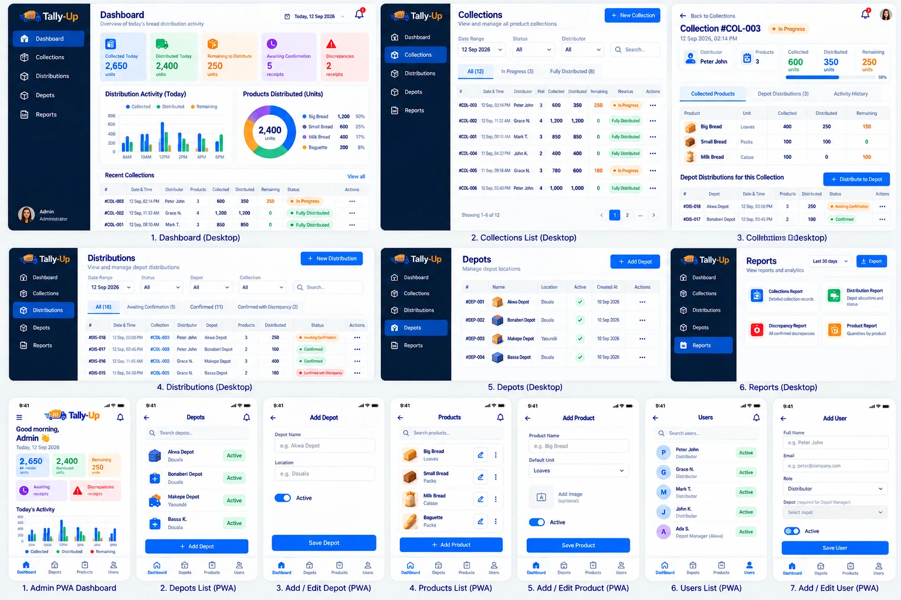
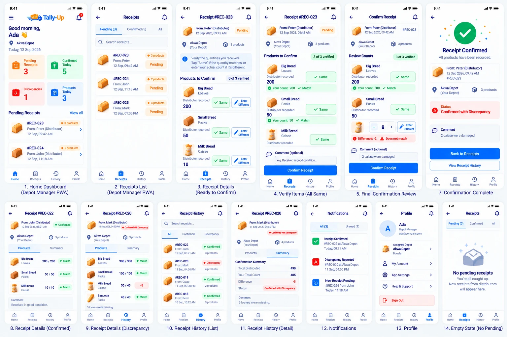
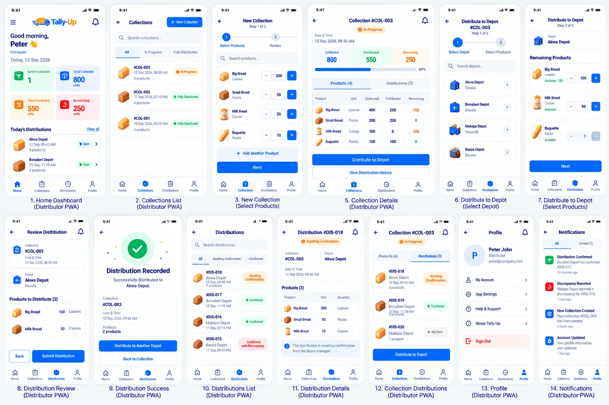

# Tally-Up — Proposed Wireframes

**Status:** Visual direction ACCEPTED 2026-10-02, with the corrections listed below.
**Rule (owner decision WD-1):** where a wireframe and `docs/REQUIREMENTS.md` disagree, the requirements win. Each conflict is listed below with its fix.

The wireframes set the **visual direction**: layout, density, colour family, card style, icon style, navigation placement. They are not pixel specifications. Some labels in the images are garbled (e.g. "Creribute to Depot", "Colltctions") and will not be copied.

## Files

| File | Contents |
|---|---|
| [`01-admin-desktop-and-pwa.webp`](01-admin-desktop-and-pwa.webp) | Admin desktop: Dashboard, Collections list, Collection detail, Distributions, Depots, Reports. Admin PWA: Dashboard, Depots list, Add/Edit Depot, Products list, Add/Edit Product, Users list, Add/Edit User. |
| [`02-depot-manager-pwa.webp`](02-depot-manager-pwa.webp) | Depot Manager PWA: Home, Receipts list, Receipt details, Verify items, Final review, Confirmation complete, Receipt details (confirmed / discrepancy), Receipt history list + detail, Notifications, Profile, Empty state. |
| [`03-distributor-pwa.webp`](03-distributor-pwa.webp) | Distributor PWA: Home, Collections list, New Collection, Collection details, Distribute (select depot, select products), Distribution review, Success, Distributions list + details, Collection distributions, Profile, Notifications. |

---

## Review Against Requirements

Each item names the screen, what the wireframe shows, the requirement it touches, and the proposed fix. Severity: **High** = changes a business rule; **Medium** = missing required content; **Low** = wording or consistency.

### W-A. Across all portals

| # | Sev | Wireframe shows | Requirement | Proposed fix |
|---|---|---|---|---|
| W-A1 | High | Single totals in "units" that add loaves, packs and caisse together (e.g. "Collected Today 2,650 units", "Total Collected 800 units", donut "2,400 units") | ADM-02, REC-04 | Show per unit ("1,200 Loaves · 310 Packs · 45 Caisse"), or in loaves where the requirement says loaves. Never a mixed "units" total. |
| W-A2 | Medium | Same record numbered `#DIS-018` for the distributor and `#REC-023` for the depot | Req. §11 `distributionNumberFormat` | One number per hand-over, shown the same everywhere. Owner picks the prefix (DIS- or REC-). |
| W-A3 | Low | Status labels vary: "Pending", "Sent", "Not Sent", "Awaiting Confirmation" | NFR-11, Req. §8 | Use only: Awaiting Confirmation, Confirmed, Confirmed with Discrepancy, In Progress, Fully Distributed. "Sent"/"Not Sent" do not exist (no drafts). |
| W-A4 | Medium | Profile has "App Settings", "Help & Support", "About Tally-Up" | Req. §14 "nothing outside this document" | Remove, or owner adds them to requirements with defined content. |
| W-A5 | Low | Notifications include "New Collection Created", "Account Updated", and receipt results sent to the depot manager | NOT-01…NOT-05 | Show only the four defined notifications, unless the owner adds more. |
| W-A6 | Medium | Light grey table text and pastel status chips at small sizes | WCAG 1.4.3 (UI_GUIDELINES §5) | Keep the look, darken text to pass 4.5:1. |

### W-B. Admin

| # | Sev | Wireframe shows | Requirement | Proposed fix |
|---|---|---|---|---|
| W-B1 | Medium | Sidebar has 5 items (Dashboard, Collections, Distributions, Depots, Reports) | Req. §7: also Discrepancies, Products, Users, Notifications, Settings, Audit | Full sidebar per requirements. |
| W-B2 | Medium | Admin PWA uses a bottom nav (Dashboard, Depots, Products, Users) | NFR-09: drawer on mobile | Owner decides: drawer (as written) or bottom nav with 4 items + "More". |
| W-B3 | High | Add Product: one "Default Unit" dropdown | PRD-02…PRD-05 | Product form needs Code, Description, multiple supported units, and a required "loaves per Pack / Caisse" field. |
| W-B4 | Medium | Add Depot: Name, Location, Active only | DEP-02 | Add Address/Description, Phone, Assigned Manager. |
| W-B5 | Medium | Add User: no Phone; role list shows Distributor | USR-01, USR-02 | Add Phone; Role includes Admin; no password field shown to others (initial password handled per architecture §5.2). |
| W-B6 | Medium | Depots table has no Manager column | DEP-02 | Add Manager column. |
| W-B7 | Medium | Not drawn: Discrepancies page, Receipt detail with corrections, Users desktop, Products desktop, Reports filters + PDF preview, Audit log, Notifications, Settings, Login, Forgot password | ADM-05, COR-*, RPT-*, AUD-* | Owner supplies, or they are built from these rules and the existing visual style, then reviewed. |

### W-C. Depot Manager

| # | Sev | Wireframe shows | Requirement | Proposed fix |
|---|---|---|---|---|
| W-C1 | **High** | "Same" button copies the distributor's number with one tap; guidance text "Tap Same if the quantity matches" | RCP-04: count fields start empty; manager must type each count | Remove "Same". Show an empty count field per line. |
| W-C2 | High | Count is a single −/+ stepper in the recorded unit | RCP-05, RCP-06: any unit, several units per line | Each line: count entry with unit picker and "+ Add another unit" (e.g. 19 Packs + 5 Loaves). Live loaf total. |
| W-C3 | High | Difference shown as "−2" in the line's unit | REC-02: difference in loaves, original units also shown | "Difference: −100 Loaves (recorded 10 Caisse, counted 8 Caisse)". |
| W-C4 | High | Summary tab: "Total Distributed 490 / Your Total Count 485" across products | REC-04 | Remove cross-product totals. Per-product lines only. |
| W-C5 | Medium | Final review has no lock warning | RCP-10 | Add "Once confirmed, this receipt cannot be edited." above the Confirm button. |
| W-C6 | Low | Success screen title "Receipt Confirmed" with a green check, then status "Confirmed with Discrepancy" | RCP-11 | Title "Receipt recorded"; icon and colour follow the computed status. |

### W-D. Distributor

| # | Sev | Wireframe shows | Requirement | Proposed fix |
|---|---|---|---|---|
| W-D1 | Medium | Bottom nav: Home, Collections, Distributions, Profile | Req. §7: also History | Add History (5 items). |
| W-D2 | High | New Collection: each product has a fixed unit | COL-02, COL-04 | Unit picker per row; same product allowed in two units. |
| W-D3 | High | Distribute: each product has a fixed unit; "Available: 150" | DIS-02, DIS-04 | Unit picker per line; available shown as "430 Loaves (8 Caisse + 3 Packs)". |
| W-D4 | Medium | Success screen: no receipt status, no updated remaining; buttons "Distribute to Another Depot" / "Back to Collection" | DIS-09 | Add "Awaiting Depot Confirmation" and remaining per product; second button "Back to Dashboard". |
| W-D5 | Low | −/+ steppers for quantities in the hundreds | UI_GUIDELINES §3 (Fitts), §6 | Keep steppers for small changes, but the number itself is a large typeable field with numeric keypad. |

---

## Decisions (owner, 2026-10-02)

| # | Question | Decision |
|---|---|---|
| WD-1 | Requirements vs wireframes | **Requirements win** where they conflict. All W-items above are fixed in the build. |
| WD-2 | Hand-over number prefix (W-A2) | **DIS-** (e.g. DIS-00018), everywhere. |
| WD-3 | Admin navigation (W-B1, W-B2) | Desktop: side tabs, **max 7**. Phone: **4 bottom tabs**. Which pages go where: decided later (NAV-1 in requirements). |
| WD-4 | Profile extras (W-A4) | **Remove** App Settings, Help & Support, About. |
| WD-5 | Missing screens (W-B7) | Designed together with the owner when their phase comes. |
